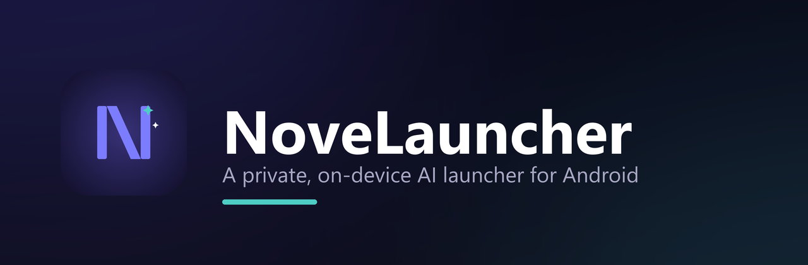
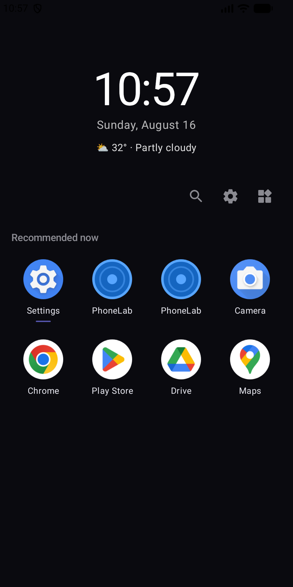
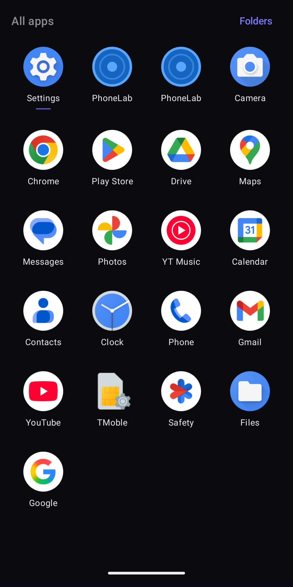
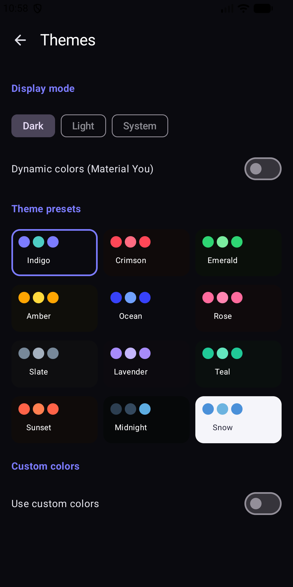
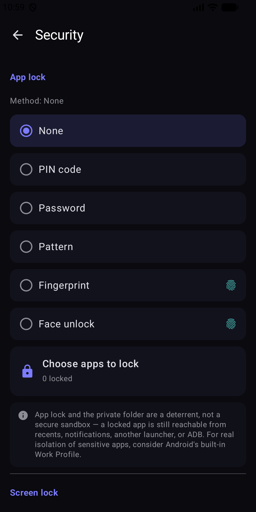

<div align="center">



<br>

**Un launcher Android qui apprend vos habitudes — sans jamais les envoyer ailleurs.**

[](https://github.com/DrummingBird1/NoveLauncher/releases/latest)
[](#configuration-requise)
[](https://kotlinlang.org)

[**Site web**](https://drummingbird1.github.io/NoveLauncher/) ·
[**Télécharger**](https://github.com/DrummingBird1/NoveLauncher/releases/latest) ·
[**Confidentialité**](https://drummingbird1.github.io/NoveLauncher/privacy.html) ·
[**Journal des modifications**](../../CHANGELOG.md) ·
[**Contribuer**](../../CONTRIBUTING.md)

**Autres langues :**
[English](../../README.md) ·
[עברית](README.he.md) ·
[العربية](README.ar.md) ·
[Русский](README.ru.md) ·
[Español](README.es.md) ·
[Deutsch](README.de.md)

</div>

---

## Présentation

NoveLauncher remplace l'écran d'accueil d'Android. Il classe et regroupe vos
applications selon votre usage réel — ce que vous ouvrez, quand et à quelle
fréquence — pour que l'essentiel soit déjà devant vous.

Le classement s'exécute **entièrement sur votre appareil**. Aucun compte,
aucun serveur, aucune analyse d'audience, aucune publicité. Vos données
d'utilisation ne quittent jamais votre téléphone.

## Fonctionnalités

| | |
|---|---|
| 🧠 **Classement intelligent** | Applications triées par récence, fréquence, heure de la journée et catégorie — calculé localement |
| 📁 **Dossiers intelligents** | Regroupement automatique en 11 catégories, sans tri manuel |
| 🎨 **Personnalisation poussée** | 12 palettes, Material You, couleurs personnalisées, polices, 12 formes d'icônes, packs d'icônes |
| 🔒 **Verrouillage d'applications** | Code PIN, mot de passe, schéma ou biométrie par application, dossier privé et applications masquées |
| 🌍 **7 langues** | Hébreu, anglais, arabe, français, russe, espagnol, allemand — entièrement compatible RTL |
| 📰 **Fil d'actualités** | Sources intégrées et vos propres flux RSS |
| 💾 **Sauvegardes** | Local, Google Drive ou NAS/WebDAV, planifiées, avec chiffrement par mot de passe en option |
| 📊 **Statistiques d'usage** | Temps d'écran et utilisation, stockés uniquement sur l'appareil |
| 🔍 **Recherche globale** | Applications, contacts et paramètres depuis un seul champ |
| 🧩 **Widgets et dock** | Widgets Android standard et dock inférieur épinglé |

## Captures d'écran

<div align="center">






</div>

## Confidentialité

C'est la raison d'être du projet, autant être précis :

- **Rien n'est collecté.** Aucune analyse d'audience, aucune télémétrie,
  aucun rapport de plantage dans les versions distribuées, aucun compte,
  aucune publicité.
- **Les données d'usage restent locales.** Les statistiques sont stockées dans
  une base de données sur votre appareil et servent uniquement au classement.
- **Le seul appel réseau** est le widget météo, qui envoie des coordonnées
  approximatives à [Open-Meteo](https://open-meteo.com) — et seulement si vous
  accordez la permission de localisation. Sinon, une ville par défaut est utilisée.
- **Vos sauvegardes vous appartiennent.** En local, sur votre Google Drive ou
  votre NAS, avec un chiffrement par mot de passe que vous seul détenez.

Détail complet : [**Politique de confidentialité**](https://drummingbird1.github.io/NoveLauncher/privacy.html) ·
[Conditions d'utilisation](https://drummingbird1.github.io/NoveLauncher/terms.html)

> **À propos du verrouillage :** le verrouillage d'applications, le dossier
> privé et les applications masquées sont **dissuasifs, pas un bac à sable
> sécurisé**. Une application « verrouillée » reste accessible via les
> applications récentes, les notifications, un autre launcher ou ADB — c'est
> vrai de tout launcher tiers. Pour une isolation réelle, utilisez le profil
> professionnel intégré à Android.

## Téléchargement

Récupérez l'APK signé depuis la [**dernière version**](https://github.com/DrummingBird1/NoveLauncher/releases/latest).

Vous devrez autoriser l'installation depuis des sources inconnues. Toutes les
versions sont signées avec la même clé, les mises à jour s'installent donc
proprement les unes sur les autres.

### Configuration requise

- Android 8.0 (API 26) ou plus récent
- Environ 25 Mo de stockage

## Compiler depuis les sources

```bash
git clone https://github.com/DrummingBird1/NoveLauncher.git
cd NoveLauncher/android
./gradlew assembleDebug
```

Ouvrez le dossier **`android/`** dans Android Studio (Ladybug ou plus récent)
— pas la racine du dépôt, qui n'est pas un projet Gradle.

## Contribuer

Les issues et pull requests sont les bienvenues — voir
[CONTRIBUTING.md](../../CONTRIBUTING.md). Pour tout problème de sécurité,
lisez [SECURITY.md](../../SECURITY.md) et signalez-le en privé.

## Soutenir le projet

NoveLauncher est gratuit, sans publicité et sans achats intégrés. Pour
soutenir le développement :

<div align="center">

[](https://www.patreon.com/cw/MrIdan)
[](https://buymeacoffee.com/novelauncher)

</div>

## Contact

Questions, bugs ou suggestions : **solvaris2@gmail.com** ou
[ouvrez une issue](https://github.com/DrummingBird1/NoveLauncher/issues).

## Licence

Voir [LICENSE](../../LICENSE). Le code est publié à des fins de transparence
et de revue — il n'est pas sous licence open source.
